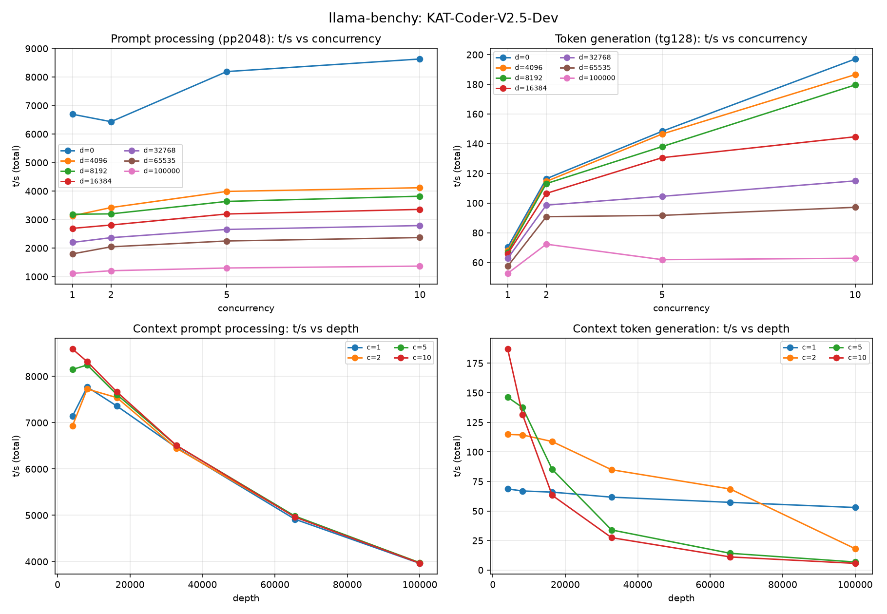

# Benchmarks

Throughput benchmarks for every recipe in this repo, run with [llama-benchy](https://github.com/Sean-Vallo/llama-benchy) against a vLLM endpoint on a single DGX Spark (128 GB unified LPDDR5X).

## Layout

Each model gets two artifacts in this folder, named `<model>.{csv,png}`:

| File | Purpose |
|---|---|
| `<model>.csv` | Raw llama-benchy CSV output (source of truth) |
| `<model>.png` | 4-panel chart (pp/tg t/s vs concurrency, ctx_pp/ctx_tg t/s vs depth) |

To add a new model: run the bench command from the project [README](../README.md), then generate the chart:

```bash
uvx --with pandas --with matplotlib python scripts/chart_benchy.py \
  benchmarks/<model>.csv benchmarks/<model>.png
```

## Models

| Model | Recipe | Bench | Chart |
|---|---|---|---|
| `KAT-Coder-V2.5-Dev` | [kat-coder-v2.5-dev-nvfp4.yaml](../kat-coder-v2.5-dev-nvfp4.yaml) | [csv](kat-coder-v2.5-dev-nvfp4.csv) | [png](kat-coder-v2.5-dev-nvfp4.png) |

## KAT-Coder-V2.5-Dev



### Headline numbers (single stream, concurrency = 1)

| Depth | pp t/s | tg t/s | ttfr (ms) |
|---:|---:|---:|---:|
| 0 | 6 695 | 70 | 363 |
| 4 096 | 3 134 | 68 | 704 |
| 8 192 | 3 188 | 67 | 692 |
| 16 384 | 2 693 | 66 | 813 |
| 32 768 | 2 201 | 63 | 983 |
| 65 535 | 1 798 | 57 | 1 194 |
| 100 000 | 1 115 | 53 | 1 887 |

### Real-life expectations

- **~52–70 tokens/s** sustained generation per interactive coding session (drops with context depth).
- **Sub-second prefill** for prompts up to ~8k context; ~700 ms ttfr at 8k, rising to ~1.9 s at 100k.
- Concurrency > 1 grows total throughput but drops per-request speed — **stay at c=1 for interactive coding**. Scale users by adding replicas, not by raising concurrency on one process.

See the project [README](../README.md) for the exact `llama-benchy` command used to produce these numbers.